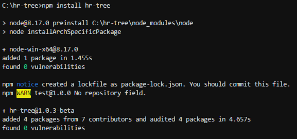
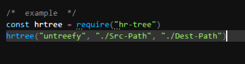

# hr-tree
List, Treefy and Untreefy Directories

# Installation : 
npm install hr-tree

  
# Usage :

  const hrtree = require("hr-tree")
  
  hrtree(parametre1, parametre2, parametre3)
  

# Parameters to be passed :

      View as List : ("view", "<Source Path>" , "-l")
      View as Tree : ("view:, "<Source Path>" , "-t")
      Treefy : ("treefy", "<Source Path>" , "<Destination Path>")
      (Proper Metadata.json file is required)
      UnTreefy : ("untreefy", "<Source Path>" , "<Destination Path>")

Note : MetaData.json will be stored in Destination Directory.

# Prequested Modules :
1. UUID : For generating Random File Names while Untreefying.

    npm install uuid
    
    
